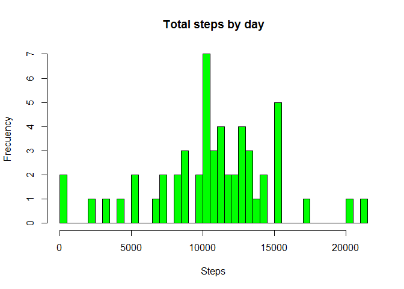
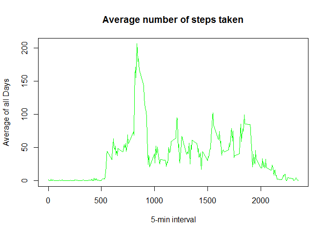
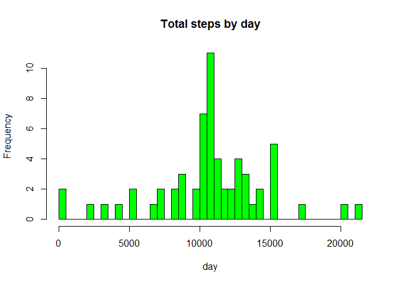
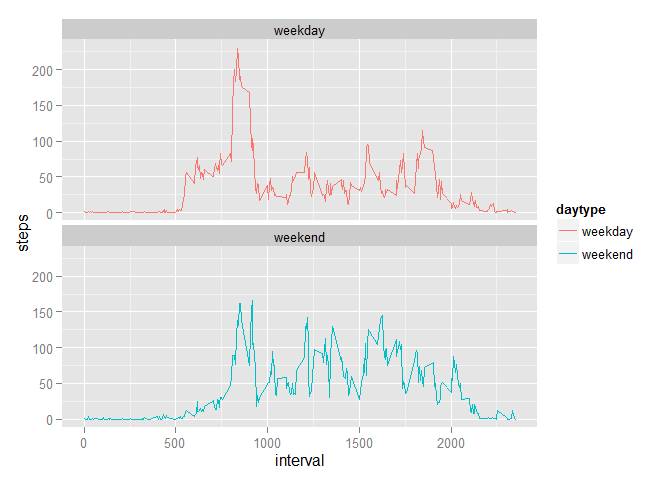

# Reproducible Research: Peer Assessment 1

This assignment makes use of data from a personal activity monitoring device. This device collects data at 5 minute intervals through out the day. The data consists of two months of data from an anonymous individual collected during the months of October and November, 2012 and include the number of steps taken in 5 minute intervals each day.

## Loading and preprocessing the data


```r
  activity<-read.csv("activity.csv")
  summary(activity)
```

```
##      steps                date          interval     
##  Min.   :  0.00   2012-10-01:  288   Min.   :   0.0  
##  1st Qu.:  0.00   2012-10-02:  288   1st Qu.: 588.8  
##  Median :  0.00   2012-10-03:  288   Median :1177.5  
##  Mean   : 37.38   2012-10-04:  288   Mean   :1177.5  
##  3rd Qu.: 12.00   2012-10-05:  288   3rd Qu.:1766.2  
##  Max.   :806.00   2012-10-06:  288   Max.   :2355.0  
##  NA's   :2304     (Other)   :15840
```

```r
  head(activity)
```

```
##   steps       date interval
## 1    NA 2012-10-01        0
## 2    NA 2012-10-01        5
## 3    NA 2012-10-01       10
## 4    NA 2012-10-01       15
## 5    NA 2012-10-01       20
## 6    NA 2012-10-01       25
```

```r
  library(lattice)
  activity$date <- as.Date(activity$date, "%Y-%m-%d")
```
The variables included in this dataset are:

- steps: Number of steps taking in a 5 minute interval (missing values are coded as NA )
- date: The date on which the measurement was taken in YYYY?MM?DD format
- interval: Identifier for the 5 minute interval in which measurement was taken

The dataset is stored in a comma?separated?value (CSV) file and there are a total of 17,568 observations in this dataset. 


## What is mean total number of steps taken per day?

To draw the histogram of total no. of steps taken

```r
  totalSteps <- aggregate(steps ~ date, data = activity, sum, na.rm = TRUE)

  summary(totalSteps)
```

```
##       date                steps      
##  Min.   :2012-10-02   Min.   :   41  
##  1st Qu.:2012-10-16   1st Qu.: 8841  
##  Median :2012-10-29   Median :10765  
##  Mean   :2012-10-30   Mean   :10766  
##  3rd Qu.:2012-11-16   3rd Qu.:13294  
##  Max.   :2012-11-29   Max.   :21194
```

```r
  hist(totalSteps$steps, 
     breaks=50,     
     main = "Total steps by day", 
     xlab = "Steps", 
     ylab = "Frecuency",
     col = "green")
```

 


The mean of the total steps taken


```r
mean(totalSteps$steps)
```

```
## [1] 10766.19
```

The median of the total steps taken


```r
median(totalSteps$steps)
```

```
## [1] 10765
```

## What is the average daily activity pattern?

Time series plot of the steps taken with 5 min. interval with average steps taken


```r
time_series <- tapply(activity$steps, activity$interval, mean, na.rm = TRUE)

plot(row.names(time_series), time_series, type = "l", 
     main = "Average number of steps taken", 
     xlab = "5-min interval", 
     ylab = "Average of all Days", 
     col = "green")
```

 
Maximum no. of steps taken during

```r
max_interval <- which.max(time_series)
names(max_interval)
```

```
## [1] "835"
```


## Imputing missing values
To impute missing values, first find out how many missing values are there


```r
activityNA <- sum(is.na(activity))
activityNA
```

```
## [1] 2304
```
Replace the missing value by mean in 5 min interval


```r
StepsAverage <- aggregate(steps ~ interval, data = activity, FUN = mean)
fill_na <- numeric()
for (i in 1:nrow(activity)) {
    obs <- activity[i, ]
    if (is.na(obs$steps)) {
        steps <- subset(StepsAverage, interval == obs$interval)$steps
    } else {
        steps <- obs$steps
    }
    fill_na <- c(fill_na, steps)
}
```
New data set with all the filled in missing data


```r
activity2 <- activity
activity2$steps <- fill_na
head(activity2)
```

```
##       steps       date interval
## 1 1.7169811 2012-10-01        0
## 2 0.3396226 2012-10-01        5
## 3 0.1320755 2012-10-01       10
## 4 0.1509434 2012-10-01       15
## 5 0.0754717 2012-10-01       20
## 6 2.0943396 2012-10-01       25
```

```r
totalSteps2 <- aggregate(steps ~ date, data = activity2, sum, na.rm = TRUE)
head(totalSteps2)
```

```
##         date    steps
## 1 2012-10-01 10766.19
## 2 2012-10-02   126.00
## 3 2012-10-03 11352.00
## 4 2012-10-04 12116.00
## 5 2012-10-05 13294.00
## 6 2012-10-06 15420.00
```
Histogram of total no. of steps taken each day

```r
hist(totalSteps2$steps, 
     breaks=50, 
     main = "Total steps by day", 
     xlab = "day", 
     col = "green")
```

 

Calculate mean of total steps taken per day

```r
mean(totalSteps2$steps)
```

```
## [1] 10766.19
```

Calculte median of total steps taken per day

```r
median(totalSteps2$steps)
```

```
## [1] 10766.19
```

We found very small diferences, only the median change.


## Are there differences in activity patterns between weekdays and weekends?

First we need to get the day information for the corresponding date given in the activity

```r
day_col <- weekdays(as.Date(activity2$date))
day_col <- ifelse(day_col %in% c("sábado","domingo"), yes = "weekend", "weekday")
```
Saturday and Sunday are assigned as weekends and rest of the days as weekday

```r
x <- aggregate.data.frame(activity2$steps, by = list(activity2$interval, day_col), FUN = mean, na.rm = T)
colnames(x) <- c("interval", "daytype", "steps")
```
Panel plot containing a time series plot (i.e. type = "l") of the 5-minute interval (x-axis) and the average number of steps taken, averaged across all weekday days or weekend days (y-axis).


```r
library(ggplot2)
```

```
## Warning: package 'ggplot2' was built under R version 3.1.2
```

```r
ggplot(data=x, aes(x=interval, y=steps, group=daytype)) + geom_line(aes(color=daytype)) + facet_wrap(~ daytype, nrow=2)
```

 
